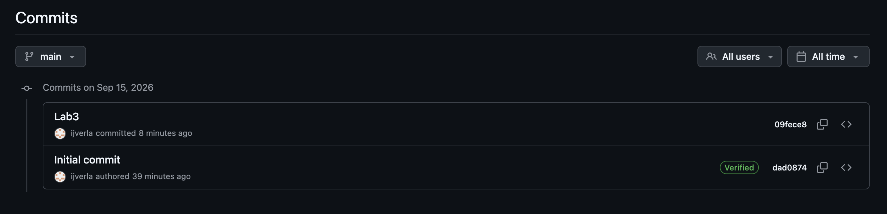

## Question 1

When pressing pull I get the message "Already up to date". This makes sense because my computer has more files than github has. I am "ahead" of GitHub.

## Question 2-3

install.packages should go into the console. Library is typed into the .qmd file since it's a function

## Question 4

```{r}
palmerpenguins::penguins
```

Before I installed the package an error came up but after I installed it, the code printed a data set.

## Question 5

No, it works without needed the library function as seen above .

## Question 6

Put supressWarnings before your code and surround the following function with (). Ex. suppressWarnings(library(dplyr))

## Question 7

https://dplyr.tidyverse.org/

## Question 8


